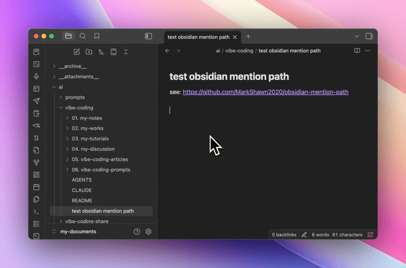

  

<h1 align="center">
  
  Mention Path
</h1>

  <strong>Quickly insert relative file and folder paths in Obsidian using @ trigger</strong> 
  Obsidian Plugin

  <a href="#features">Features</a> •
  <a href="#usage">Usage</a> •
  <a href="#installation">Installation</a> •
  <a href="#settings">Settings</a>

---

## Features

| Feature | Description |
|---------|-------------|
| **Trigger-based Autocomplete** | Type `@` to instantly activate suggestions. Only triggers after whitespace or at line start. |
| **Parent Navigation (`../`)** | Navigate up to parent directories. Supports chaining like `../../`. |
| **Vault Root (`~/`)** | Jump directly to vault root with `~/`, then browse from there. |
| **Folder Drill-down** | Selecting a folder navigates into it instead of closing the popup. |
| **Recursive Search** | Search without `/` to find matches across all subdirectories. |
| **Smart Sorting** | Special dirs first (`~/`, `../`), then folders, then files. Shallower paths appear first. |
| **Relative Paths** | Inserted paths are relative to current file, making links portable. |
| **Custom Trigger** | Change the default `@` to any single character in settings. |

## Usage

1. Type `@` anywhere in a note
2. Start typing to filter files/folders
3. Use `../` or `~/` for directory navigation
4. Select folder to drill down, or file to insert path

## Installation

### Manual

1. Download `main.js`, `manifest.json`, `styles.css` from [releases](https://github.com/MarkShawn2020/obsidian-mention-path/releases)
2. Create `.obsidian/plugins/mention-path/` in your vault
3. Copy downloaded files into the folder
4. Reload Obsidian and enable in Settings → Community Plugins

### BRAT

Install via [BRAT](https://github.com/TfTHacker/obsidian42-brat): `MarkShawn2020/obsidian-mention-path`

## Settings

| Setting | Description | Default |
|---------|-------------|---------|
| Trigger character | Character that activates path suggestions | `@` |

## License

MIT
